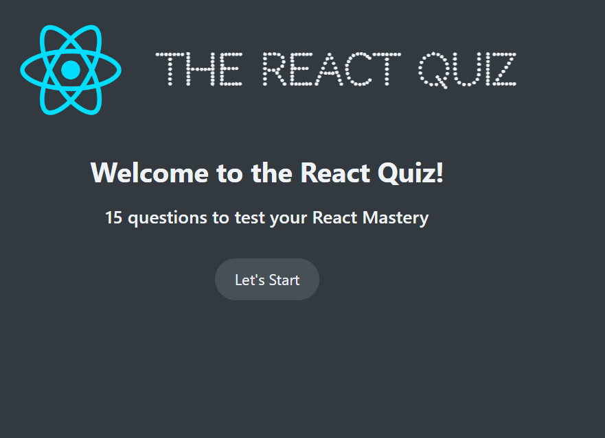
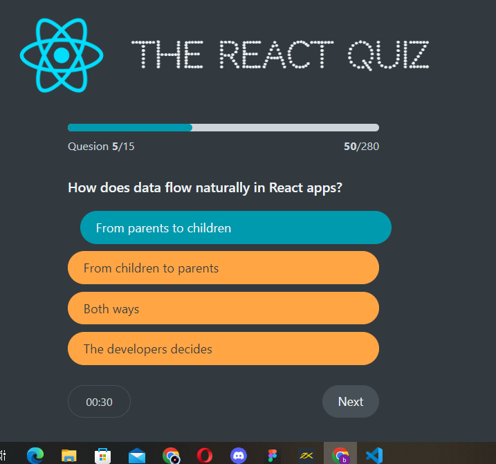

# React Quiz Game

### Features
- Utilizes the useReducer Hook to handle multiple states

- Utilizes the useEffect Hook to fetch questions data from a node server 

- A realtime timer on each question ; You would immediately see the validity of your answer (whether its correct or wrong)

- Realtime progress bar indicating your effort in percentage ; 

- Win points for the correct answers !

